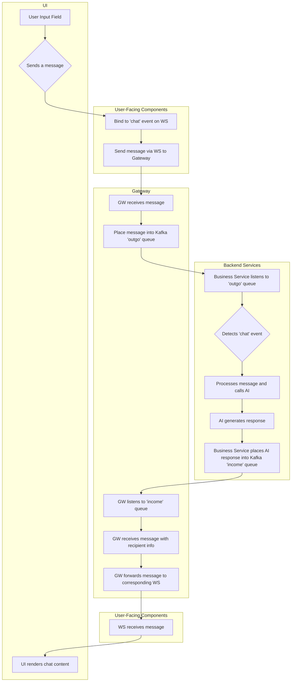

# Events flow. Intelligence appears.

```nu
use ,.nu
, serve --rpk
```

or

gateway
```nu
use ,.nu
, rpk up
, gw up
```

ui
```nu
use ,.nu
, ui up
```


## chat
```nu
use ,.nu
, pg up
, pg migrate
, chat up
```

# Design

Flow Description:
- User Input: A user types a message into the input field on the UI.
- Bind to 'chat' event: The UI binds the message to a 'chat' event on the WebSocket (WS).
- Send to Gateway (GW): The UI sends the message via the WS to the GW.
- GW Receives Message: The GW, acting purely as a message router, receives the incoming message.
- Place in 'outgo' queue: The GW places the message into a Kafka queue named 'outgo' for processing by backend services.
- Business Service Listens: A backend business service continuously listens to the 'outgo' queue.
- Detects 'chat' event: The business service retrieves the message and identifies it as a 'chat' event.
- Call AI: The business service processes the message and sends it to the AI for a response.
- AI Generates Response: The AI processes the request and generates a response.
- Place in 'income' queue: The business service places the AI's response into another Kafka queue named 'income'.
- GW Listens to 'income': The GW also listens to the 'income' queue for outgoing messages.
- GW Receives with Recipient Info: The GW retrieves the AI's response, which includes information about the intended recipient on its "envelope".
- Forward to WS: The GW uses the recipient information to send the message to the corresponding WS connection.
- WS Receives Message: The WS receives the message from the GW.
- UI Renders Content: The UI receives the message from the WS and renders the new chat content.

## message broker

## control center
In the `chat/src/libs/logic` directory, there are several control centers (business logic is implemented here, and they are separate services, so they're called control centers).

`echo` is the simplest one - it echoes back whatever you send, similar in nature to hello world.

`chat` is like slack-style chat, divided by channels.

`crm` is for AI customer service - both users chatting and backend customer service agents can see it (if they need to grab orders), and it assigns users to one or more agents.

Users see a single chat box, while customer service sees multiple channels, so `chat` needs to be implemented first.

## UI
### menu
Currently, components basically bind to a single value, for example, a text input box corresponds to a string "xxx"
For menus, there are two values: one is all the candidate options, and the other is the already selected value
Previously, I thought about putting the candidate options in children, but it's not convenient for dynamic binding, and defining styles is also cumbersome (normally define an item value as the style for all child items, rather than wrapping all child items with styles and copying them N times (referencing the rack component design)

If a component can bind to multiple values, one approach is to add an additional field on top of the (existing) value field. But this can get messy and inconsistent
Another approach is to refactor the value field to accept multiple values. But this involves more changes (this shows the advantage of Rust; if it were JavaScript, I wouldn't even dare to imagine how painful it would be), and additionally, you need to declare extra fields when binding (but you can specify a default value)
