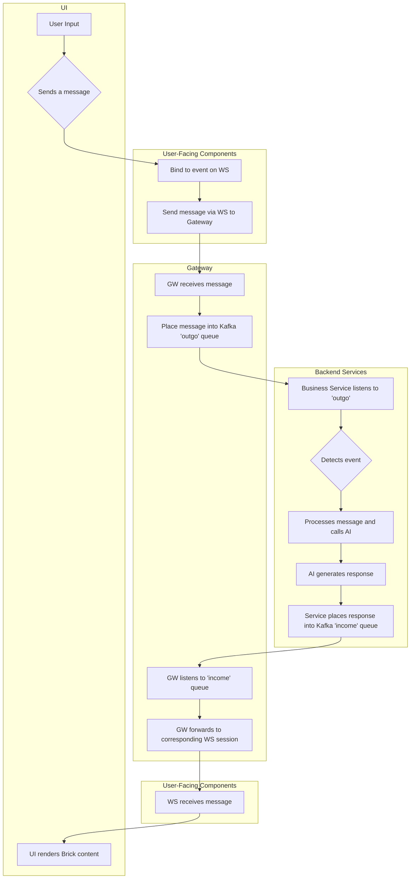

# Fluxora

> Events flow. Intelligence appears.

An **event-driven, AI-native UI framework** built in Rust. Fluxora decouples business logic from presentation through a message-queue-centric architecture, using a declarative JSON DSL (`Brick`) to describe interfaces. AI generates structured JSON (not code), validated by auto-exported JSON Schema, rendered dynamically by Dioxus/WASM.

## Architecture

```
┌──────────┐   WS    ┌──────────┐  outgo   ┌─────────────────┐
│   UI     │◄───────►│ Gateway  │─────────►│ Business Service│
│ (Dioxus) │         │ (Axum)   │          │ (Chat, CRM, AI…)│
└──────────┘         └────┬─────┘          └────────┬────────┘
                          │   income                │
                          └─────────────────────────┘
```

- **UI**: WASM frontend (Dioxus) renders `Brick` JSON trees. Components bind to event names — no API URLs, no HTTP verbs.
- **Gateway**: WebSocket router. Dispatches UI events to Kafka/Iggy `outgo` queue; delivers backend `income` messages to the correct WS session.
- **Business Services**: Independent consumers of `outgo`/`income`. Each service (chat, crm, echo, analysis…) handles its own logic, calls AI, pushes results back. Services are **transparent** to each other — an analysis service can intercept chat streams without the chat service knowing.

## Quick Start

### Gateway

```nu
use x.nu
x rpk up          # --external host.docker.internal
x gw up
```

### UI

```nu
use x.nu
x ui up
```

### Chat Service (demo)

```nu
use x.nu
x pg up
x pg migrate
x chat up
```

## Design

### Data Flow


```mermaid
graph TD
    subgraph UI
        A[User Input] --> B{Sends a message};
    end

    subgraph User-Facing Components
        B --> C[Bind to event on WS];
        C --> D[Send message via WS to Gateway];
    end

    subgraph Gateway
        D --> E[GW receives message];
        E --> F[Place message into Kafka 'outgo' queue];
    end

    subgraph Backend Services
        F --> G[Business Service listens to 'outgo'];
        G --> H{Detects event};
        H --> I[Processes message and calls AI];
        I --> J[AI generates response];
        J --> K[Service places response into Kafka 'income' queue];
    end

    subgraph Gateway
        K --> L[GW listens to 'income' queue];
        L --> M[GW forwards to corresponding WS session];
    end

    subgraph User-Facing Components
        M --> N[WS receives message];
    end

    subgraph UI
        N --> O[UI renders Brick content];
    end
```

### Core Concepts

#### 1. Brick DSL — Declarative JSON UI

The `brick` crate defines a typed JSON object tree for describing UI components. Every component is a `#[serde(tag = "type")]` enum variant — unambiguous, token-efficient, and schema-derivable.

```json
{
  "type": "rack",
  "id": "main",
  "sub": [
    { "type": "text", "bind": { "source": "chat.msg" } },
    { "type": "input", "bind": { "event": "chat.send", "type": "text" } }
  ]
}
```

Key properties:
- **`sub`**: recursive child nesting (tree structure).
- **`item`**: list item template (for `rack`, `fold`).
- **`bind`**: declarative data/event binding. No API URLs, no fetch/axios.
- **`id`**: unique identifier for streaming merge targeting.

#### 2. Declarative Binding

Components declare what events they listen to or emit — **not how to call APIs**.

```json
{
  "bind": {
    "chat_input": { "event": "chat.send", "type": "text" },
    "chat_output": { "source": "chat.msg" }
  }
}
```

- **`source`**: listen to an event stream (GET-equivalent).
- **`event`**: emit an event (POST-equivalent).
- **`target` / `field` / `submit`**: advanced binding modes.

The Gateway maps event names to Kafka topics automatically. Input components implicitly POST; display components implicitly GET.

#### 3. Template System

For fixed business scenarios, UI is defined as **templates** (minijinja), not AI-generated on the fly.

```
Business Service → returns pure data
                 → Gateway applies template → renders Brick JSON → UI
```

- Templates are registered at startup or via metadata API.
- `/api/cart` returns raw data; `/ui/cart` applies `template_cart`.
- Webhooks can intercept specific events (e.g., login) for special handling.
- Business services and internal APIs are completely template-agnostic.

#### 4. Streaming Merge — Localized Path Updates

AI responses are streamed token-by-token. Fluxora merges updates **relative to the component's bound data source**, not globally.

```rust
// Three merge strategies:
Replace   // overwrite the value
Concat    // append (text concat, number add, array push, object merge)
Delete    // remove (string replace, number subtract, object key removal)
```

Components merge by `id` matching. Multiple services can stream to the same page simultaneously without conflicts — each component's merge is isolated to its own data boundary.

#### 5. AI-Native, Not AI-Dependent

- **Design-time**: AI generates `Brick` JSON + mock data → preview in UI → save as template.
- **Run-time**: templates render at millisecond speed, zero LLM latency.
- **Exploratory**: AI generates one-off UIs dynamically (dashboards, presentations) when structure is unpredictable.
- **Hybrid**: fixed business uses templates; dynamic scenarios use AI generation.

## Crates

| Crate | Description |
|-------|-------------|
| `brick` | Core JSON DSL — Brick enum, attributes, binding, serialization, JsonSchema export |
| `brick_macro` | Derive macros for `BrickOps`, `ClassifyBrick`, `ClassifyAttrs`, render hints |
| `message` | Unified message protocol — Envelope, ChatMessage, Event trait, Kafka/Iggy adapters |
| `content` | Content action types — Create, Set, Join, Tmpl, Empty. Method enum (Replace/Concat/Delete) |
| `gateway` | WebSocket router + template engine + webhook dispatcher + session management |
| `ui` | Dioxus/WASM frontend — Frame renderer, dynamic component dispatch, WS store, streaming merge |
| `ui_macro` | UI component derive macros |
| `chat` | Demo business service — channel-based chat with user/agent management |
| `agent` | Agent service skeleton |

## Key Design Decisions

### Why JSON, not JSX/HTML?
- **LLM Efficiency**: LLMs generate structured JSON with far fewer tokens and higher accuracy than raw code.
- **Schema Validation**: Auto-exported JSON Schema (from Rust types) provides deterministic validation.
- **Error Recovery**: Invalid output triggers automatic rewrite — no "broken UI" from hallucinated code.

### Protocol Agnosticism & Configurable Codecs
- **Codec Enum Architecture**: The message layer uses `ActiveCodec` enum dispatch (not `Box<dyn Codec>`) since generic trait methods are not object-safe. Wire protocol is specified via configuration.
- **CBOR Default**: **CBOR** (`ciborium`) is the primary binary protocol. It offers near-bincode performance while being an IETF standard (RFC 8949) with type self-description, partial parsing support, and cross-language compatibility (JS `cbor-x`, etc.).
- **Bincode Rejected**: Previously considered as default but removed due to serde 2.x incompatibility (v1.x broken, v2.x API unstable), lack of type self-description (Gateway cannot partially parse routing metadata), and no cross-language support. See `docs/decisions/001-reject-bincode-for-cbor.md` for full rationale.
- **JSON for Debug/AI**: JSON codec is preserved for AI-generated content and debugging — the DSL remains JSON-structured for AI compatibility and human readability, while transport uses efficient binary encoding.

### Why Event Sourcing?
- **Decoupling**: Business services are independent Kafka consumers. Add/remove services without touching others.
- **Auditability**: Full event history enables replay, debugging, and AI analysis.
- **Multi-Agent Collaboration**: Services can transparently intercept streams and inject responses.

### Why Separate Queues?
- **Flow Control**: AI streaming messages are high-frequency and fragmented. A dedicated queue prevents them from blocking low-frequency control messages (system notifications, user joins, etc.).

### Merge Strategy: Streaming UX & Structural Routing
- **Mandatory Deserialization**: Every incoming message must be fully deserialized to identify the target component and update path. We prioritize accurate structural routing over raw byte-append optimizations.
- **Smoothness vs. Efficiency**: We merge updates frequently (per token) to ensure fluid UI rendering ("typing effect"). While this incurs higher CPU/memory costs (allocation, expansion) compared to a single "bulk copy," it prevents browser lag and jank, which is the priority for user experience.
- **Protocol Overhead**: The layered message structure (metadata, receivers, routing) implies that for small payloads (like a single token), the protocol overhead exceeds the payload size. This is an inherent cost of the decoupled, event-driven architecture.
- **Mitigation**: We use `Vec<String>` buffers for text content to mitigate repeated allocation costs during streaming, though this is a secondary optimization to the core **Declarative Binding** design which drives the architecture.
- **Localized Scope**: Global state reconciliation is O(N²) and error-prone. Localized merge (per-component, per-data-source) is O(N) and conflict-free. Each component owns its data lifecycle.

### Component Atomicity: Table & SVG
- **Direct Mapping**: Components like `Table` and `SVG` are kept **atomic** and map directly to standard HTML/SVG elements.
- **AI Alignment**: LLMs are heavily trained on standard HTML/SVG. Keeping these atoms ensures high generation accuracy.
- **No Over-Abstraction**: Encapsulating these into "semantic wrappers" is unnecessary and hinders flexibility.

### Concurrency: Sync Template Engine
- **CPU-Bound Nature**: Template rendering (`minijinja`) is purely computational (no IO). The blocking time is negligible (microseconds).
- **Overhead Avoidance**: Using `spawn_blocking` or complex async wrappers adds unnecessary overhead for lightweight text processing.
- **Scalability**: The system handles sync rendering efficiently; async offloading is reserved for high-concurrency/heavy-template scenarios only.
